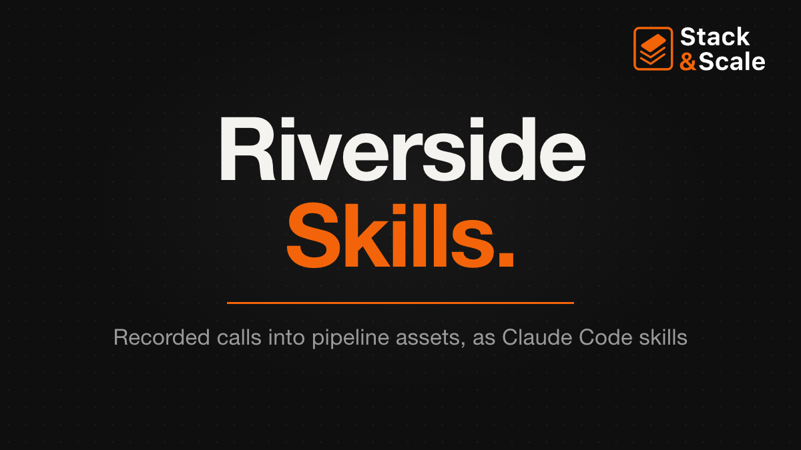

# Riverside Skills

**Sixteen Claude Code skills that turn the recordings your company already makes into pipeline assets, built on Riverside's MCP.**

Most of your company's discovery calls, customer interviews, win/loss conversations, demos, webinars, and podcast episodes get recorded and transcribed, and almost none of that material ever reaches marketing. These skills go get it. They pull messaging evidence from sales calls and case studies from customer interviews, run a podcast pipeline, and cut clips from all of the above, with the permission problem handled before anything leaves the building.

The whole pack is skills plus plain text files in a `workspace/` folder on your machine. You don't host an app or run a database, and you need no API key beyond your Riverside connection.

> Companion to [Stack & Scale](https://stackandscale.ai) Issue 47, *Your best GTM content is already recorded*, which walks through setup and four workflows with copy-paste prompts. Riverside sponsored that issue.

---

## Why this exists

Most B2B video advice tells you to go make more video. This pack starts from the recordings you already have, which puts it on the pipeline side of the budget instead of the content side.

Those recordings go unused for boring reasons. They belong to sales or CS, they live in a tool marketing doesn't log into, pulling anything out of them is nobody's job, and whoever suggests it gets told to check with legal first. The editing got easy. Permission is still the hard part, so the pack is built around permission.

## Three rules, and what enforces each

A rule written into a skill is a suggestion the model can talk itself out of. So each rule here is backed by something that runs.

| Rule | What enforces it |
|---|---|
| **Nothing fabricates.** Every quote carries its recording and timestamp, every number a customer said aloud is flagged until confirmed in writing, and every asset carries its clearance status | `clearance-check` decides whether a recording is cleared for public use, from a `clearance.md` that must name the approver, the date, and the written evidence. A skill that gets a non-zero exit stops. `content-quality-gates` checks every quote against the transcript with Riverside's exact-phrase search |
| **Nothing publishes until you've looked at it.** The skills draft, cut, and schedule. You approve, then Riverside posts | `.claude/settings.json` puts every Riverside tool that posts, changes a post, renders an export, or edits the brand kit behind a Claude Code `ask` rule, so Claude Code stops and asks you first, whatever the skill says |
| **Every recording gets one canonical cut.** One file is the source of truth, so when it changes you know what went stale | `stale-check` compares every logged asset against the current `edit_id@revision` and lists the ones built from an older version |

The scripts live in `skills/riverside-skills/scripts/`. They're a few dozen lines of Bash each, so you can read them.

---

## The 16 skills

**Start here**
- `riverside-skills` – checks your setup, then routes you to the right skill

**Pipeline assets from recordings you already have**
- `research-call-mining` – discovery and win/loss calls mined for the words prospects use, set against your homepage
- `customer-interview-engine` – interview guide, consent, then a case study where every quote is verbatim and every number is flagged
- `sales-enablement-clips` – an objection library from real calls, with the best rep answer to each

**Podcast**
- `podcast-episode-pipeline` – record to publish, stopping for your review before anything goes out
- `podcast-recut-and-republish` – for the night the wrong cut is live and everything downstream points at it
- `podcast-show-notes-and-chapters` – chapters, titles, and show notes from the canonical edit's timeline
- `podcast-host-and-rss` – the part Riverside's MCP doesn't cover: getting the file onto your host
- `podcast-guest-ops` – booking, prep brief, the release, and the guest's own asset pack

**Repurposing**
- `clip-selection` – every candidate moment scored, the top five with reasons, cut only after you pick
- `social-asset-pack` – per-platform captions, titles, hooks, and thumbnail briefs for approved clips
- `transcript-to-written` – newsletter issues, blog posts, and LinkedIn text posts from a transcript
- `distribution-and-scheduling` – the only skill that publishes. Calendar, confirmation, then status until it's live

**Events**
- `webinar-production` – run-of-show, then the live recording into on-demand and clips

**Quality**
- `content-quality-gates` – clearance, verbatim quotes, numbers, staleness, and platform limits, then a score
- `skill-capture-loop` – turning a task you've done three times into a skill, and proving each fix landed

---

## Quickstart

You need Claude Code and a Riverside Grow, Webinar, or Business plan, which is where the MCP is included.

```bash
claude mcp add --transport http --scope user riverside https://mcp.riverside.com/mcp
git clone https://github.com/guerrilla2799/riverside-skills.git
cd riverside-skills
claude
```

In Claude Code, run `/mcp`, choose riverside, and finish the sign-in in your browser. Then:

```
Check my Riverside setup.
```

The `riverside-skills` router lists your five most recent recordings. If they come back, you're connected. Full install options, including copying the skills into your personal folder, are in [INSTALL.md](INSTALL.md).

Start with `research-call-mining` on ten recent discovery calls. It pays off fastest, and it's internal, so there's no customer permission to chase.

---

## What Riverside's MCP covers, and what it doesn't

It covers transcript search across your archive, plain-language editing (cuts, filler and pause removal, captions, layouts, brand kit, closing cards), exports, and publishing or scheduling to YouTube, YouTube Shorts, TikTok, Instagram, Facebook, LinkedIn, and X.

It doesn't hand you a download link for a render, manage your podcast host, see recordings that live in Gong or Zoom until you upload them to Riverside, or unpublish a post once it's live. The skills route around each of those.

The full tool-by-tool reference, verified against the live MCP, is in [docs/riverside-mcp.md](docs/riverside-mcp.md).

## Docs

| Doc | What is in it |
|---|---|
| [riverside-mcp.md](docs/riverside-mcp.md) | Every Riverside tool the skills use, the gotchas, what the MCP doesn't cover, and the approval gate |
| [canonical-cut.md](docs/canonical-cut.md) | One source of truth per recording, what goes stale when it changes, and how to find it |

## Your recordings stay local

Everything the skills produce goes into `workspace/`, one folder per recording, and `workspace/` is gitignored along with every audio, video, and caption file type the skills handle. Customer calls, guest recordings, and anything under NDA never end up in a commit by accident.

## What this is not

- Not a Riverside product. It's an independent open-source project built on Riverside's public MCP.
- Not legal advice. The clearance gate checks that you recorded written approval. It can't tell you what approval your contracts or your jurisdiction require.
- Not a publishing bot. Nothing goes out without a person saying yes to the exact post.

No client names, customer metrics, or real recordings appear in this repo. Every example is an anonymized composite.

## License

MIT. See [LICENSE](LICENSE).

Built by [Brandon Redlinger](https://www.linkedin.com/in/brandonredlinger/) · [Stack & Scale](https://stackandscale.ai)
